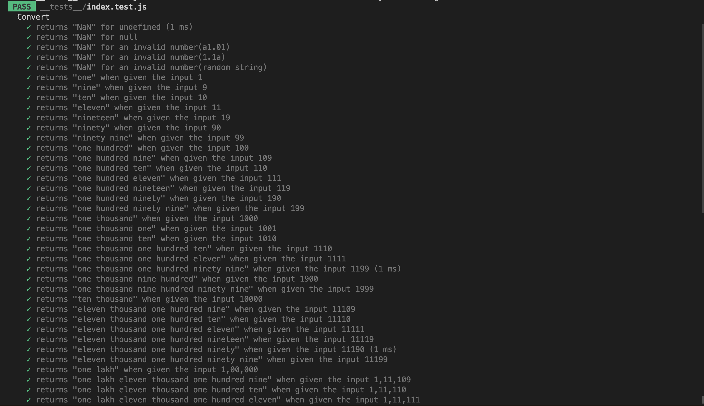

# currency-in-words

**Convert currency or any number formats to respective words**
___
> **Note**
___
> | 1. Current version supports only indian system. But, subsequent versions will support international version.|
> | 2. Commas in the test cases are just for readability, but doesn't support in the input.                     |
___

### Installation:

```javascript
npm i currency-in-words
```

### Usage:

```javascript
import { convert } from 'currency-in-words'

const result = convert('777')
```

> Refer the images(test-cases) for more insight.

Adding test-case results just to make your life easier..




As we know it's hard to define the scope of a software. The scalability it offers is also a potential danger, as we might end up in a
forever loop, adding feature after feature. Hence couple of limitations has been set going forth.

1. Ignoring all decimals after two decimal places.
2. Never going to address/handle commas in the input.
3. Out put for decimals is in the format 'xxx yyy zzz.xx yy' without any spaces on either sides of the period, this is probably not gonna change for the sake of backward compatability. But you can always manipulate it with a little bit of your code.
